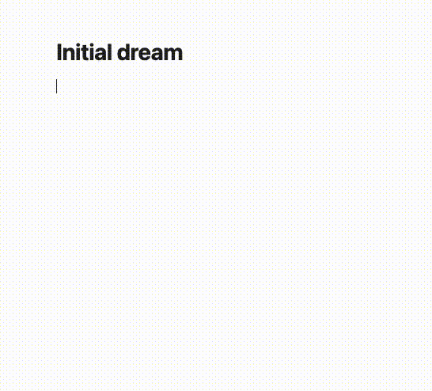

# oraculum-exactus - beta

Oraculum Exactus is an Obsidian plugin that provides a suite of tools for generating random outcomes, making decisions, and exploring possibilities within your notes. Whether you're a writer seeking inspiration, a gamer looking for random events, or someone who enjoys the thrill of chance, Oraculum Exactus has you covered.

## license - the code here

This project is licensed under the MIT License - see the [LICENSE](LICENSE) file for details.

## license - the ironsworn oracles

They are from the amazing [datasworn](https://github.com/rsek/datasworn) project. From their README:

> Core package content (the typings and JSON schema) and internal tooling use the MIT license.
>
> Textual and image content (in other words, the actual content from the rulebooks as described in JSON, Markdown, and other files) is CC-BY-4.0 or CC-BY-NC-4.0.
>
> Additionally, the JSON files embed licensing information in the source property that appears on many objects throughout Datasworn.

### ironsworn - the game

Ironsworn classic is a full fledged tabletop roleplaying game by Shawn Tomkin. It is available as a free download from [tomkinpress](https://tomkinpress.com/). You can see all the products and supplements there.

## license - the dicier dice font

The amazing Dicier typeface can be found [here](https://speakthesky.itch.io/typeface-dicier). From the userd guide:

Dicier is available under the Creative Commons Attribution 4.0
International license, or [CC BY 4.0](https://creativecommons.org/licenses/by/4.0/).

## license - the immersion oracles

Their from ancient times and I don't know the original source. If you do, please let me know so I can give proper credit.

# vision

Adding more stuff over time - if I have the time and the need.

# how it began

I had some TTRPG tools from over the years (in C#, Go, Elixir, etc). Around three years ago, they became an Obsidian plugin. But the updates broke the plugin, and I never got around to fixing it (stopped using Obsidian for a while). Recently, played some solo RPG and wanted to use the plugin again, so I fixed it & cleaned it up. Hopefully they don't break the plugin system anytime soon. Enjoy!
